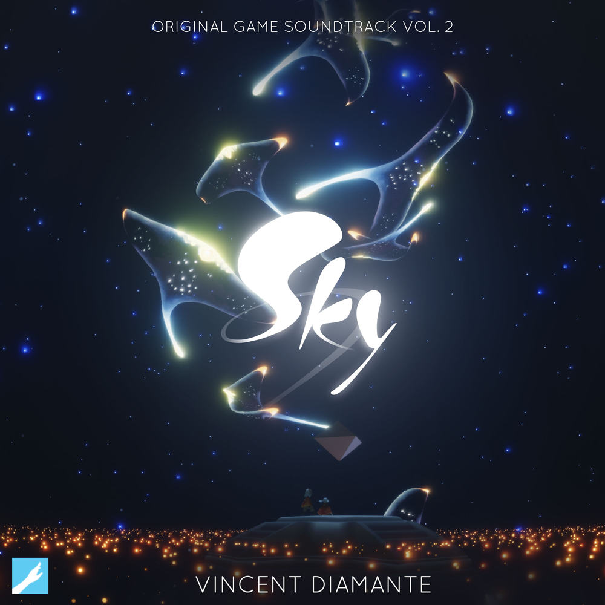

# Sky (Original Game Soundtrack) Vol. 2

- **Artist:** Vincent Diamante
- **Duration:** 01:13:36
- **Genre:** Video Game Soundtrack
- **Release Date:** 16.07.2021
- **Label:** thatgamecompany
- **Format:** 16-bit/44.1kHz FLAC

Sky: Children of the Light is an open world indie adventure game where players can explore the seven realms of a vast kingdom while connecting with loved ones. This is the second volume of the original game soundtrack, composed by Vincent Diamante.

### Vincent Diamante, The Composer
Vincent Diamante is an American composer and sound designer, known for his work on video game soundtracks such as Flower, Journey, and Sky: Children of the Light. His compositions for Sky: Children of the Light perfectly capture the game's atmospheric and emotional essence.

### Tracklist:
01. Elliptical (02:15)
02. Threshold (03:00)
03. Uncertain Joy (06:10)
04. A Bell-Ringer (03:56)
05. Village of Air (02:02)
06. The Walls (02:41)
07. Pottery Walk (01:39)
08. Heavy Mist (03:08)
09. Light Fog (02:26)
10. The Rain Reveals Everything (03:29)
11. Waves in Time (02:44)
12. Scattered Toys (01:31)
13. Ellipses (03:19)
14. In the Rain (02:14)
15. For Those About to Race (02:21)
16. Over the Mountains (04:06)
17. The Vast Everything (02:56)
18. The Embrace of Sands (02:41)
19. The Emergence (02:00)
20. Ashes (02:37)
21. Passage of Times (01:22)
22. Waves of Disquiet (02:51)
23. Conduits of Fortune (02:15)
24. Quietude (02:12)
25. Lambent Light (04:28)
26. Something Beyond (03:33)